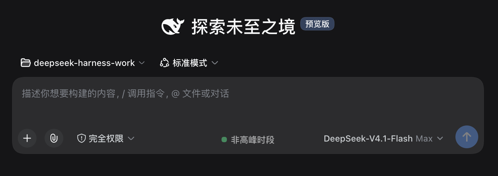

# dsh-price-phase

English | [中文](./README.md)

**A DeepSeek peak / off-peak badge for the DSH Web GUI**: shows whether you are currently in a **peak** or **off-peak** billing window, centred in the composer's bottom tool row, with a countdown to the next switch.

> Based on DeepSeek's official time-of-day pricing: **peak hours are Monday–Friday 09:00–12:00 and 14:00–18:00 Beijing time**. Every other moment — including **all of Saturday and Sunday** — is off-peak, priced at half the peak rate.



---

## What this plugin deliberately does not do

Several peak-hour indicators already exist. This one is scoped to **do one thing**:

- No timezone conversion (the official rule is defined in Beijing time; converting from UTC+8 is the least error-prone approach)
- No 24-hour timeline, price table, or detail modal
- No click interactions, no host state reads, no network requests
- **Zero third-party dependencies** — only `require('react')`

Every decision comes from the browser's local clock converted to UTC+8, so it works offline, has no latency, and can never show a stale state because a request failed.

## Features

| Capability | Notes |
|---|---|
| Live phase | Peak / off-peak, recomputed every 30 seconds from the system clock |
| Countdown | Time until the phase **actually flips** — `2h13m` / `45m` / `38s` |
| Hover detail | Current Beijing time (with weekday), both phases, and what happens next |
| Narrow-screen layout | On phones it becomes an inline short label without the dot, so it cannot overlap the model chip |
| Correct weekend countdown | After Friday 18:00 it points to **Monday 09:00**, not Saturday 09:00 |

## Install

```sh
dsh plugin --profile web add dsh-price-phase
```

Restart DSH and the badge appears centred in the composer's bottom tool row.

`dsh plugin add` reads the `dsh.bundle.patch` field in this package's `package.json` and inserts the plugin into the profile tree for you. **No manual edit of `cordis.patch.yml` is needed.** The entry it writes is shown below, for troubleshooting only:

```yaml
- insert:
    - id: dsh-price-phase
      name: 'dsh-price-phase'
```

Installing through npm directly also works (for a hand-rolled profile, or offline distribution), but then you do add that entry yourself:

```sh
npm install dsh-price-phase
```

## Development

```sh
npm run build:bundle   # regenerate the bundle's inlined logic from lib/price-phase.js
npm run check          # syntax preflight + verify the inlined region matches the source
npm test               # 23 tests: pure logic + bundle contract
npm run verify         # all of the above
```

The decision logic inside `lib/client.js` is not hand-written: `scripts/inline-price-phase.mjs` inlines it from `lib/price-phase.js` at build time. DSH's bundle resolver only knows platform seed words and registered package ids, so requiring the package's own subpath always fails — and the logic cannot simply be hand-written into the bundle either, since then it could not be unit-tested in Node. Re-run `build:bundle` after editing `lib/price-phase.js`.

Tests come in two layers:

- `test/price-phase.test.js` — phase decisions, day and weekend boundaries, countdown landing points. Timestamps are built as `Date.UTC(y, m, d, H-8, M)` (Beijing = UTC+8), and expectations are transcribed from the official pricing footnote rather than copied out of the implementation.
- `test/client-contract.test.js` — builds a minimal browser environment in `node:vm`, actually executes `lib/client.js`, and checks that the id matches the package name, that it **only requests platform seed words**, that it **never requires its own subpaths**, that every inlined symbol is present, that `apply` registers into the right slot, and that style injection is idempotent.

  This layer is not optional. Bundle packaging mistakes surface on the host side only as `loaded without registering`, or as a single `missed the module table` line in the browser console — syntax checks like `node --check` cannot see them at all. The first release of this plugin shipped exactly such a bug, and this test is what now covers it.

## Known limits

- **Beijing time is the reference.** The official rule is defined in Beijing time; overseas users see the phase that corresponds to Beijing time. This is intentional — converting to local time would produce wrong answers.
- **No price values.** The plugin reports the phase only. Rates change, and hardcoding them client-side goes stale.
- **Registers one slot**, `conversation.input.right`. That slot is `kind: list`, so it coexists with other plugins and orders by `order: 90`.
- Depends on the DSH 0.1.5 client slot contract; earlier versions are untested.

## License

MIT
